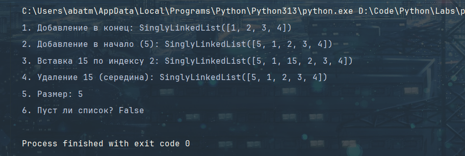

<h1>Программирование и алгоритмизация (Лабораторные)</h1>

<h2>Лабораторная №10:</h2>

<div>
    <h3>Теория по лабе</h3>
    <div>
        <h4>Стек(Stack)</h4>
        <p>Принцип: LIFO (Last In, First Out) — «последним пришёл, первым вышел». Представьте стопку тарелок: новую кладёте сверху и сверху же берёте.</p>
    </div>
    <div>
        <h4>Очередь(Queue)</h4>
        <p> Принцип: FIFO (First In, First Out) — «первым пришёл, первым вышел». Как очередь в кассу: кто первым встал, того первым и обслужат.</p>>
    </div>
    <div>
        <h4>Связный список(Linked List)</h4>
        <p>Принцип: Элементы (узлы) хранятся произвольно в памяти. Каждый узел содержит: 1) данные и 2) ссылку (указатель) на следующий узел. В двусвязном списке — также ссылку на предыдущий узел.</p>
    </div>
</div>


**Задание №1:**
```python
from collections import deque

class Stack:
    def __init__(self, array: list = []):
        # внутреннее хранилище стека
        self._data = array

    def push(self, item):
        # корректно: добавление в конец списка O(1) амортизированно
        self._data.append(item)

    def pop(self):
        # TODO: добавить обработку случая пустого стека (сейчас IndexError от list)
        try:
            return self._data.pop()
        except IndexError:
            raise IndexError('Stack is empty')

    def peek(self):
        try:
            return self._data[-1]
        except IndexError:
            return None

    def is_empty(self) -> bool:
        # TODO: улучшить реализацию
        if len(self._data) == 0:
            return True
        else:
            return False

    def __len__(self):
        return len(self._data)

class Queue:
    def __init__(self, array: list = []):
        # ошибка: вместо deque используется list → операции O(n)
        self._data = deque(array)

    def enqueue(self, item):
        # ошибка: вставка в начало, а не в конец
        self._data.append(item)

    def dequeue(self):
        # ошибка: удаление с конца, а не с начала
        return self._data.popleft()

    def peek(self):
        # TODO: корректное поведение при пустой очереди
        if len(self._data) == 0:
            raise IndexError('Queue is empty')
        return self._data[0]

    def is_empty(self) -> bool:
        return not self._data

    def __len__(self):
        return len(self._data)

if __name__ == '__main__':
    s = Stack([])
    s.push(2)
    s.push(12)
    s.push(52)
    print(f"Пуст ли стек: {s.is_empty()}")
    print(f"Верхний элемент: {s.peek()}")
    print(f"Длина стека: {len(s)}")

    print("--------------------------------------")
    q = Queue()
    q.enqueue(3)
    q.enqueue(4)
    q.enqueue(5)
    print(f"Элемент из начала: {q.dequeue()}")
    print(f"Певрый элемент: {q.peek()}")
    print(f"Длина: {len(q)}")

```


**Задание №2:**
```python
class Node:
    def __init__(self, value, next=None):
        self.value = value
        self.next = next

    def __str__(self):
        return str(self.value)


class SinglyLinkedList:
    def __init__(self) -> None:
        self.head = None
        self.tail = None
        self._size = 0

    def append(self, value):
        """Добавить элемент в конец списка"""
        new_node = Node(value)

        if self.head is None:  # Если список пустой
            self.head = new_node
            self.tail = new_node
        else:
            self.tail.next = new_node  # Старый tail указывает на новый узел
            self.tail = new_node  # Обновляем tail на новый узел

        self._size += 1

    def prepend(self, value):
        """Добавить элемент в начало списка"""
        new_node = Node(value, next=self.head)
        new_node.next = self.head
        self.head = new_node
        self._size += 1
        # TODO: обновить размер

    def insert(self, idx, value):
        if idx < 0:
            raise IndexError("negative index is not supported")

        new_node = Node(value)

        if idx == 0:
            new_node.next = self.head
            self.head = new_node
            return

        current = self.head

        for _ in range(idx - 1):
            if current is None:
                raise IndexError("list index out of range")
            current = current.next

        if current is None:
            raise IndexError("list index out of range")
        new_node.next = current.next
        current.next = new_node
        self._size += 1

    def remove_at(self, idx):
        if idx < 0:
            raise IndexError("negative index is not supported")

        if self.head is None or idx >= self._size:
            raise IndexError("list index out of range")

        if idx == 0:
            value = self.head.value
            self.head = self.head.next

            if self.head is None:
                self.tail = None

            self._size -= 1
            return value

        current = self.head
        for _ in range(idx - 1):
            current = current.next

        node_to_delete = current.next
        value = node_to_delete.value

        current.next = node_to_delete.next

        if node_to_delete == self.tail:
            self.tail = current

        self._size -= 1
        return value

    def __iter__(self):
        current = self.head
        while current is not None:
            yield current.value
            current = current.next

    def __len__(self):
        return self._size

    def __repr__(self):
        values = list(self)
        return f"SinglyLinkedList({values})"


linkedlist = SinglyLinkedList()
linkedlist.append(1)
linkedlist.append(2)
linkedlist.append(3)
linkedlist.append(4)
print(f"1. Добавление в конец: {linkedlist}")
linkedlist.prepend(5)
print(f"2. Добавление в начало (5): {linkedlist}")
linkedlist.insert(2, 15)
print(f"3. Вставка 15 по индексу 2: {linkedlist}")
linkedlist.remove_at(2)
print(f"4. Удаление 15 (середина): {linkedlist}")
print(f"5. Размер: {len(linkedlist)}")
print(f"6. Пуст ли список? {len(linkedlist) == 0}")
```

