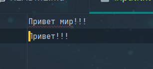
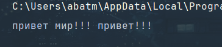
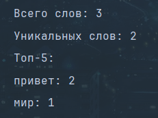
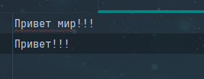

<h1>Прграммирование и алгоритмизация (Лабараторные)</h1>

<h2>Лабараторная №4:</h2>

**Задание №1:**
```python
from pathlib import Path
from text import *

def read_text(path: str | Path, encoding: str = "utf-8") -> str:
    p = Path(path)
    if not p.exists():
        raise FileNotFoundError
    try:
        text = p.read_text(encoding=encoding)
        text = normalize(text)
        return text
    except UnicodeDecodeError as e:
        raise UnicodeDecodeError() from e

import csv
from pathlib import Path
from typing import Iterable, Sequence

def write_csv(rows: Iterable[Sequence], path: str | Path,
              header: tuple[str, ...] | None = None) -> None:
    p = Path(path)
    rows = list(rows)
    with p.open("w", newline="", encoding="utf-8") as f:
        w = csv.writer(f, delimiter=",")
        if header is not None:
            w.writerow(header)
        if len(rows) != 0:
            try:
                max_len = max(len(s) for s in rows)
            except ValueError:
                raise ValueError("Ошибка записи")
            if all(len(s) == max_len for s in rows):
                for r in rows:
                    w.writerow(r)
            else:
                raise ValueError("Длина строк не одинаковая")
        else:
            w.writerows(rows)
txt = read_text("../data/lab04/input.txt") # должен вернуть строку
print(txt)
write_csv([("word","count"),("test",3)], "../data/lab04/check.csv")
```





--------------------------------------------------------------------
**Задание №2:**
```python
from collections import Counter
import csv
from pathlib import Path
from typing import Iterable, Sequence
import argparse
from src.lab03.text_stats import text_info

def frequencies_from_text(text: str) -> dict[str, int]:
    from text import normalize, tokenize
    tokens = tokenize(normalize(text))
    return Counter(tokens)


def sorted_word_counts(freq: dict[str, int]) -> list[tuple[str, int]]:
    return sorted(freq.items(), key=lambda kv: (-kv[1], kv[0]))


def write_csv(rows: Iterable[Sequence], path: str | Path,
              header: tuple[str, ...] | None = None) -> None:
    p = Path(path)
    rows = list(rows)
    with p.open("w", newline="", encoding="utf-8") as f:
        w = csv.writer(f)
        if header is not None:
            w.writerow(header)
        for r in rows:
            w.writerow(r)


def main():
    parser = argparse.ArgumentParser(description='Анализ частоты слов')
    parser.add_argument('--input', '-i', default="../data/lab04/input.txt")
    parser.add_argument('--output', '-o', default="../data/lab04/report.csv")
    parser.add_argument('--top', type=int, default=5)

    args = parser.parse_args()
    
    with open(args.input, 'r', encoding='utf-8') as f:
        text = f.read()
        text_info(text, False)

    freq = frequencies_from_text(text)
    sorted_counts = sorted_word_counts(freq)

    Path(args.output).parent.mkdir(parents=True, exist_ok=True)
    write_csv(sorted_counts, args.output, header=('word', 'count'))

if __name__ == "__main__":
    main()
```




-------------------------------------------
